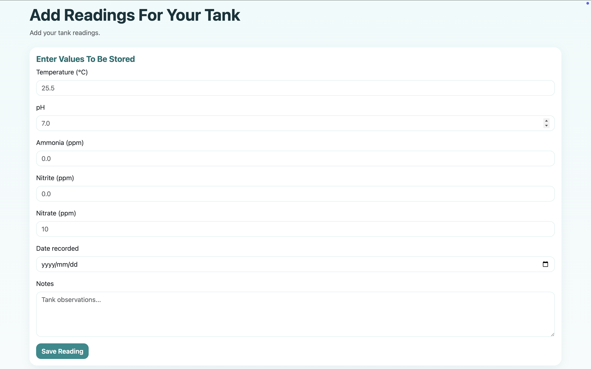
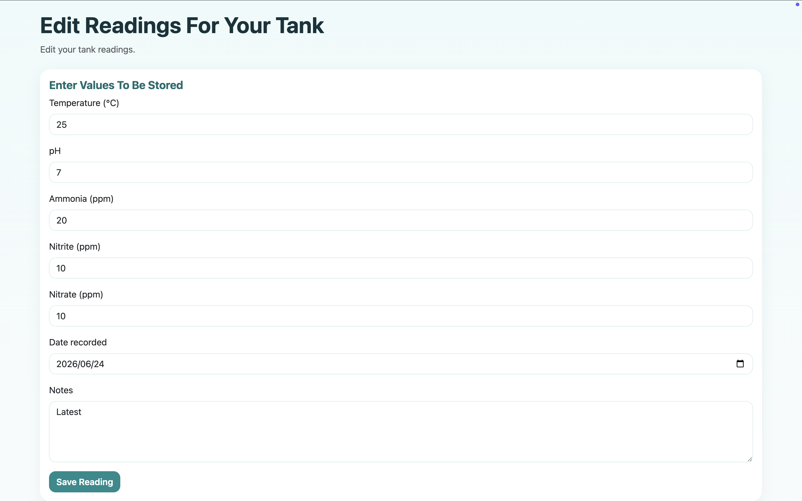
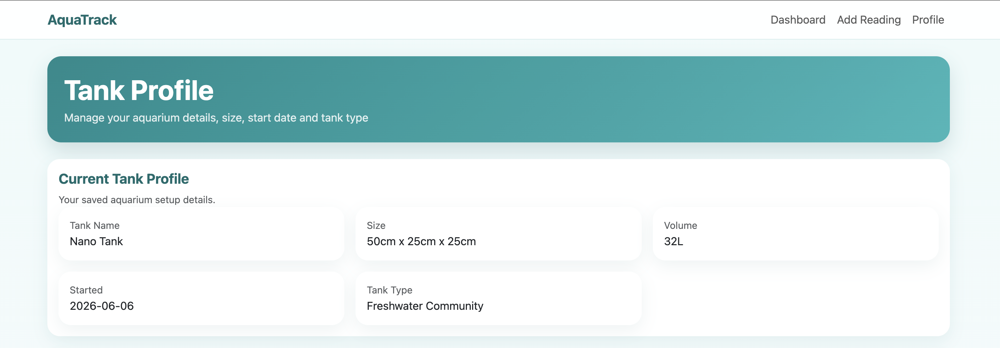
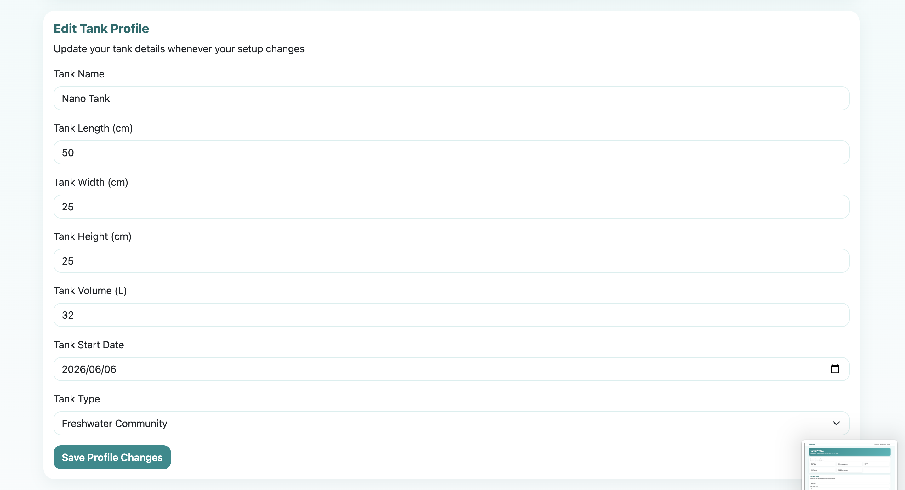

# AquaTrack

AquaTrack is a responsive web application designed to help aquarium hobbyists monitor the health of their aquarium by recording water parameters, tracking maintenance, and visualizing trends over time.

The application provides a clean dashboard that displays the latest tank status, maintenance reminders, historical readings, statistics, and parameter trends to help users make informed decisions about their aquarium.

---
## Live Demo

[Launch AquaTrack](https://ettienne-aquatrack.netlify.app/)

---

##  Screenshots

### Dashboard

The dashboard provides a complete overview of the aquarium, including the latest readings, tank health, dashboard alerts, maintenance reminders, and recommendations.


---

### Add Reading

Quickly record new water parameter readings for your aquarium.



---

### Edit Reading

Update existing readings whenever new measurements need correction.



---

### Tank Profile

Store important information about your aquarium including dimensions, volume, setup date and tank type.




---

## Features

### Dashboard
- Displays the latest recorded tank readings
- Tank health indicator
- Health recommendations
- Dashboard alerts
- Maintenance summary

### Reading Management
- Add new water parameter readings
- Edit existing readings
- Delete readings
- Search previous readings
- Sort readings by date

### Statistics & Trends
- Average parameter values
- Highest and lowest readings
- Total number of readings
- Parameter trend analysis
- Interactive charts powered by Chart.js

### Tank Profile
- Create and edit a tank profile
- Store:
  - Tank name
  - Tank dimensions
  - Tank volume
  - Tank start date
  - Tank type

### Validation
- Form validation before saving data
- User-friendly error handling
- Prevents invalid aquarium readings

### Data Storage
- Uses LocalStorage to persist data
- No database required
- Works completely in the browser

---

## Technologies Used

- HTML5
- CSS3
- Bootstrap 5
- JavaScript (ES6)
- Chart.js
- LocalStorage

---

## Project Structure

```
AquaTrack
│
├── css/
│   └── custom.css
│
├── js/
│   ├── config/
│   ├── pages/
│   ├── storage/
│   ├── utils/
│   └── validation/
│
├── index.html
├── add-reading.html
├── edit-reading.html
└── profile.html
```

The project follows a modular architecture where each file has a single responsibility:

- **config** – Application configuration
- **storage** – LocalStorage operations
- **validation** – Input validation
- **utils** – Business logic and calculations
- **pages** – Page-specific functionality

---

## Future Improvements

Planned features include:

- Backend API
- User accounts
- Cloud database
- Multiple aquarium support
- Water testing history
- Image uploads
- Fish and plant inventory
- Feeding schedules
- Mobile notifications

---

## What I Learned

Building AquaTrack helped me strengthen my understanding of:

- Modular JavaScript architecture
- DOM manipulation
- LocalStorage for client-side persistence
- Form validation
- Responsive design with Bootstrap
- Data visualization using Chart.js
- Organizing larger front-end projects into maintainable modules
- Using Git, GitHub, and Netlify to manage and deploy a web application

## Author

**Ettienne Janse van Vuuren**

Bachelor of Information Technology

GitHub: https://github.com/Ettienne63

---

## License

This project is intended for educational and portfolio purposes.
